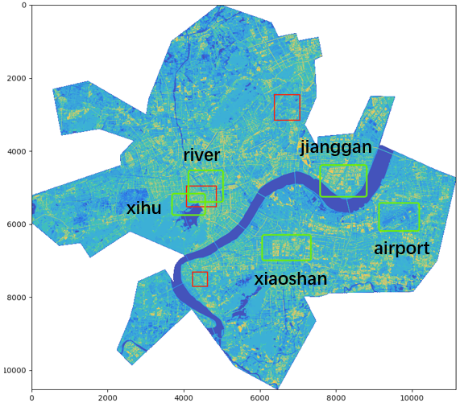
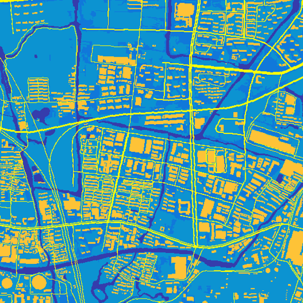

# SegHZ

      
    

杭州市 卫星图地表 20 类语义分割

- 无人机测绘标注，像素分辨率 10m (接近百度地图 z=14，分辨率 9.55m)
- **区域大小：111km × 105km**
- 标注图大小：11153 × 10532
- 标注时间 2019.12

**任务：标注图对应的原始地图无法获取，使用开放的百度地图卫星图进行地表语义分割**

## 数据处理

- 聚类了解待处理数据的特点：[数据发现](cluster/data_scenes.md)
- 对百度地图卫星图和标注图进行数据对齐：[NBBs 数据对齐](https://github.com/Shuai-Xie/NBBs)

## 研发进程

[Stage 1](#1)
- [1.1. 数据集构建](#1-1)
- [1.2. Few-shot High_Buildings 采样技巧 对分割结果的影响](#1-2)
- [1.3. 深层模型对于 边界困难像素 拥有更高的区分能力](#1-3)
- [1.4. 合并 High_Buildings 类 + PSP 区分城乡场景](#1-4)
- [1.5. BiSeNet 结构优化，增强浅层语义作用](#1-5)
- [1.6. 模型输入尺寸对 BiSeNet / HRNet 性能提升](#1-6)

小结：
- 取杭州五区数据，比较 Deeplab, BiSeNet, HRNet
- 优化 BiSeNet 结构，引入 PSP 模块处理城乡场景分割混淆
- 确定使用高分辨率特征 HRNet，模型输入尺寸为 512×512

[Stage2](#2)
- [2.1. NBBs 增广数据集](#2-1)
- [2.2. 使用 label smooth 和 噪声掩码 抑制标注噪声](#2-2)
- [2.3. 引入注意力机制 联系上下文语义](#2-3)
- [2.4. 多角度 ensemble, 多角度推理一致性 loss, 在线困难样本挖掘 ohem](#2-4)
- [2.5. 边界优化，保边上采样, SegFix, 边界掩码 [todo]](#2-5)

小结：
- 增广数据，使用 NBBs 跨域特征点对齐，将数据集增广到杭州全区范围
- 噪声掩码抑制标注噪声，引入 OCR 注意力，多角度推理一致性 loss
- todo: 标签图保边上采样

[Stage1 vs. Stage2 测试图 A/B/C](#1vs2)

## <a id="1">Stage 1</a>

### <a id="1-1">1.1. 数据集构建</a>

采样外观差异较大的杭州 5 区域(图中绿色矩形)收据，**手工特征点校准**，进行 20 类语义分割。

      
      
    class frequencies 
    

滑窗从大图 crop 512*512 数据，设置 overlap=0.3。

size | train | valid | test | total
:-: | :-: | :-: | :-: | :-: 
512 * 512 |706 | 200 | 200 | 1106

### <a id="1-2">1.2. Few-shot High_Buildings 采样技巧 对分割结果的影响</a>

从 class frequencies 发现 High_Buildings 类别本身尺寸小，训练样本有限，尝试不同多采样方式。

DeepLabv3+, MobileNetV2 backbone.

exp |  valid_IoU  | valid_Acc |test_IoU| test_Acc | note
-|:-:|:-:|:-:| :-: | -
baseline | 37.94 | 64.33| 36.56 | 63.80 | rand
v0 |33.14 |57.15|30.24|55.53 | fg>thre, rand
v1 | **41.01** | **66.38** | 38.62 | **65.31** | fg>thre, rand \| top[0]
v2 | 40.88 | 65.93 | **39.31** | 65.29 | fg>thre, rand \| rand

- baseline：随机从 512*512 中 crop 出 256
- v0：只采样 **buliding fg > 0.1** 的样本
- v1：采样 fg > 0.1，同时其他样本 **取 fg 最多的 (top[0])**
- v2：采样 fg > 0.1，同时其他样本 **随机取 (rand)**

    

Conclusion:
- v0：使房屋类别 acc 平均提升 2%，但导致大类 acc 下降，特别是前几类
- v1：保障房屋采样基础上，仍保留大类的采样；大类较 baseline 没有减少太多，同时提升了房屋 acc

### <a id="1-3">1.3. 深层模型对于 边界困难像素 拥有更高的区分能力</a>

DeepLabv3-mobilenetV2 vs. BiSeNet-res101，都采用 v1 采样。

exp |  valid_IoU  | valid_Acc |test_IoU| test_Acc |
-|:-:|:-:|:-:| :-: 
DeepLabv3-mobilenetV2 | 41.01 | 66.38 | 38.62 | 65.31 
BiSeNet-res101 | 44.23 | 70.35 | 42.62 | 69.76 |

      
    

Conclusion:
- 同样在训练时应用 frequency-inverted class weight，**深层模型 BiSeNet-res101 能对于房屋和城市绿地的边界区域有更准确的判断；而 DeepLabv3-mobilenetV2 并未得到细粒度的分割结果，更容易被 class_weight 带偏**。

### <a id="1-4">1.4. 合并 High_Buildings 类 + PSP 区分城乡场景</a> 

合并 High_Buildings，20 → 14

- **由于 7 类 High_Buildings 是按无人机测绘高度划分，每 10m 一类，外观基本相同，进行合并**；
- 合并后，由于 High_Buildings 之间混淆错误消失，带动整体 Acc/IoU 提升

    

分析 confusion matrix 发现，**城市绿地 Green_Land(6)** 与 **乡村 SubUrban_Village(19)** 之间存在较高混淆。
- 二者外观相似，因为人为城乡划分而分为不同类别，考虑到需要引入绿植周边建筑信息，来帮助模型 “领悟” 城乡差异；
- **Green_Land** 与 **SubUrban_Village** 附近建筑风格差异较大，如下图

      
    

尝试不同的 PSP 模块引入更大感受野特征，辅助模型判别 **Green_Land(6)** 与 **SubUrban_Village(19)**

exp |  valid_IoU  | valid_Acc |test_IoU| test_Acc | note
-|:-:|:-:|:-:| :-: | -
BiSeNet_res101 | 50.23 | 72.35 | 48.68 | 70.00 | baseline
PSP_(1,2,3,6)|**51.85** | **73.31** | 49.68 | 70.39 | bins=(1,2,3,6)
PSP_(1,3,6)| 51.03 | 72.91 | 49.32 | 70.17 | bins=(1,3,6)
PSP_(1,2,3)| 51.73 | 73.01 | **49.98** | **70.51** | bins=(1,2,3)

    

Conclusion:

- PSP 补充的大感受野信息使得 **城市 High_Buildings(9)**，**乡村 SubUrban_Village(19)** 都有明显提升，**城市绿地 Green_Land(6)** acc 略有下降，但 IoU 也有提升；
- 池化引入的大感受特征，能补充原有 /32 感受野特征，提升模型的判断能力;
- PSP bins 可按具体场景调整，兼顾 acc 和 speed

### <a id="1-5">1.5. BiSeNet 结构优化，增强浅层语义作用</a>

项目推进，又进行了类别合并，20 → 11
- 合并 green_land / subvillage 6/19
- 合并 suburban / urban OpenArea 4/5
- 合并 Hight_Buildings / parallel regular building 9/16

修改 BiSeNet 深浅层语义融合过程，做了一个深浅层过渡，增加浅层语义在最后分割头的占比。

- 图左：原始网络 spatial path (sp) 浅层语义 直接与 context path (cx) 进行 fusion
- 图右：**cx 在与 sp 融合前，先将特征聚合到 256dim，再和 sp feature 进行 fusion**

    

exp |  valid_IoU  | valid_Acc  |test_IoU| test_Acc  | note
-|:-:|:-:|:-: | :-:| -
BiSeNet | 55.41 | 73.97 | 55.92 | 72.90  | baseline
Split | *56.07(+0.66)* | **75.15(+1.18)** | *57.07(+1.15)* | **74.26(+1.36)**  | 凸显浅层特征
Split_Dice | **57.01(+1.60)** | *74.94(+0.97)* | **57.32(+1.40)** | *73.73(+0.83)*  | loss = CE + Dice
 

    

Conclusion:

- 提升浅层语义占比后，Split 和 Split_Dice 都带来了性能提升，Acc/IoU 有 1+% 提升
- **引入 Dice loss 后，7/8/10 few-shot class 的 IoU 增长更加明显**
- 整体 Acc 增长主要依靠 5 Green_land 大类的 Acc 提升
- 初次尝试 HRNet, 512 crop 256 训练，并无性能优势。

### <a id="1-6">1.6. 模型输入尺寸对 BiSeNet / HRNet 性能提升</a>

调整模型输入尺寸为 512*512，再次比较 BiSeNet 和 HRNet

exp | valid_IoU  | valid_Acc  |test_IoU| test_Acc | input
-|:-:|:-:|:-:| :-: |-|
BiSeNet_256 | 57.01 | 74.94  | 57.32 | 73.73 | 256 × 256, baseline
BiSeNet_512 | *59.11* | *77.30*  | *60.46* | **76.90** | 512 × 512
HRNet_512 | **60.00** | **77.52** | **61.23** | *76.82* | 512 × 512
 

    
    

Conclusion:

- 调大模型输入尺寸后，BiSeNet 和 HRNet 都有明显性能提升，各类 Acc/IoU 有 3~4% 提升，**其中大尺寸场景如 Water(1)/Road(11)/OperArea(4) 增长明显**
- **大尺寸模型输入，HRNet 综合性能由于 BiSeNet，高分辨率特征图开始发挥作用**

## <a id="2">Stage 2</a>

### <a id="2-1">2.1. 增广数据集</a>

- 比较杭州5区数据与杭州全部数据，聚类发现困难场景 [数据比较](cluster/data_scenes.md)
- 使用杭州全部数据，自动数据对齐 [NBBs 数据对齐](https://github.com/Shuai-Xie/NBBs)
- 注：train/valid 为 1024×1024 瓦片图 (z=18)，**test 为原尺寸大图**
- 阶段 2 类别总数整合为 7 类

size | train | valid | test | 
:-: | :-: | :-: | :-: |
1024 * 1024 | 1505 | 300 | 3 |

如何构建一个合适的 validset?

- 最大 class_distribution_entropy 思想，从现有数据集分出子集 300/1505，其各类别占比的 entropy 最大，类别越均衡
- 2-OPT 贪心解，**每次找一个与当前数据集类别分布最互补(加入后 entropy 最大)的样本**，基于这一思想重排样本顺序
- 图 (c) 随样本数目增加，子集 class_distribution_entropy 整体呈下降趋势，可截取头部样本子集作为类别均衡的 validset
- 图 (a) 为 trainset class_distribution，图 (b) 为截取头部 300 样本的 validset class_distribution

    

### <a id="2-2">2.2. 使用 label smooth 和 噪声掩码 抑制标注噪声</a>

卫星/无人机拍摄角度，季节变化等引入的标注噪声。

exp | valid_fwIoU  | valid_Acc  | test_fwIoU | test_Acc | note
-|:-:|:-:|:-:| :-: | - 
hrnet |  52.28 | 65.84 | 35.33 | 52.36 | baseline
hrnet_lbl_smooth_0.1 | 51.87 | 64.96 | 34.95 | 52.02 | epsilon = 0.1
hrnet_lbl_smooth_0.05 | 52.07 | 65.53 | 35.28 | 52.14 |  epsilon = 0.05
hrnet_thre_0.01 | 53.07 | 67.48 | 36.28 | 53.08 | loss_thre = -log(0.01)
hrnet_thre_cos(0.01, 0.1) | **53.43** | **68.28** | **36.68** | **53.54** | loss_thre cos decay

Conclusion:

- 使用 噪声掩码 比 label smooth 更适合当前数据集
- thre_0.01：模型训练后期，**“认为” 分类正确概率 <= 0.01 的 pixels 为噪声标注**
- thre_cos(0.01, 0.1)：loss_thre 以 cos 方式从 `-log(0.01)` 衰减到 `-log(0.1)`，“**越到后期，越相信模型的判断**”

### <a id="2-3">2.3. 引入注意力机制 联系上下文语义</a>

- 以原始 hrnet 结构作为 middle supervision，保证 backbone 特征性能；
- 在此基础上，加入 pam/ocr attention 模块，进一步优化分割结果

exp | valid_fwIoU  | valid_Acc  | test_fwIoU | test_Acc | memory(bs=4) | note
-|:-:|:-:|:-:| :-: | :-: | - 
hrnet | 53.43 | 68.28 | 36.68 | 53.54 | 10767MiB | baseline
+pam | **54.49** | **69.15** | 36.93 | 53.85 | 12479MiB | postional attention module
+ocr | 54.34 | 68.95 | **36.99** | **53.98** | **11197MiB** | object contextual representation

Conclusion:

- hrnet 保持 1/4 高分辨率特征图，128×128，直接使用 pam，gpu 内存会爆，使用沙漏结构 conv/2 + pam + deconv2
- 引入 pam 和 ocr attention 后，性能都有提升，**ocr 兼顾速度和性能，占用内存更少**

### <a id="2-4">2.4. 多角度 ensemble, 多角度推理一致性 loss, 在线困难样本挖掘 ohem</a>

卫星图数据不同于街景数据，可进行 翻转，旋转，主副对角线对称等 ensemble 后处理方式，提升性能。

以 [NAIC "AI+遥感影像" 竞赛(A榜)](https://naic.pcl.ac.cn/frame/2) 为例，ensemble 测试结果：

- 原始模型分割基础上，每增加一个角度，性能都会有提升
- lr 左右，tb 上下，lrtb 两次翻转，diag 主对角线，diag2 副对角线；还可用 旋转 90/180/270° 进行 ensemble

|exp | infer imgs |  valid_fwIoU |
|:---|:---: |:---:|
baseline (hrnet_w18) | 1 | 69.39938300326304
lr | 2 |69.93893228998873
lr + tb | 3 |70.19402430361616
lr + tb + lrtb |4| 70.30907740774236
lr + tb + diag |4|70.34210738720317
lr + tb + lrtb + diag | 5 | 70.40788237364328
lr + tb + lrtb + diag + diag2 | 6| 70.50339050217914

上述实验结果说明：
- **图像角度变换后，模型推理结果是不同的，ensemble 成员越多，得到的结果越准确**；
- 这些多角度推理结果不同区域，正是图像中的困难样本。

受 ensemble 启发可引入两种监督机制

- 多角度推理一致性 loss，引入 mse loss 使得不同角度的 output 结果尽可能一致
- 在线困难样本挖掘，**取多角度推理结果不同的地方作为困难样本 mask，增强这部分 loss 监督**

exp | valid_fwIoU  | valid_Acc  | test_fwIoU | test_Acc | note
-|:-:|:-:|:-:| :-: | - 
hrnet | 54.34 | 68.95 | 36.99 | 53.98 | baseline
self_op_loss | 54.45 | 69.10 | 37.12 | 54.18 | 多角度推理一致性 loss
ohem | 

### <a id="2-5">2.5. 边界优化，保边上采样, SegFix, 边界掩码 [todo]</a>

优化边界前，有一个问题待解决：**标签图保边上采样**。

如下图，由于标注图本身尺寸小，**上采样容易出现不规则的边缘，变成了标注噪声，不易直接优化这样放大的边缘**。

    

## <a id="1vs2">Stage1 vs. Stage2 测试图 A/B/C</a>

性能提升：
- 分割效果更加细腻，微小的房屋，狭长的道路开始渐渐涌现
- 密集居民区房屋分割效果提升明显
- 房屋和道路倾向于分开，而不再粘连在一起

<table>
	<tr>
	    <th></th>
        <th width="33.3%">GT</th>
        <th width="33.3%">Stage1</th>
        <th width="33.3%">Stage2</th>
	</tr>
	<tr>
	    <td>A</td>
	    <td style="padding: 5px"></td>
	    <td style="padding: 5px"></td>
	    <td style="padding: 5px"></td>
	</tr>
	<tr>
	    <td>B</td>
	    <td style="padding: 5px"></td>
	    <td style="padding: 5px"></td>
	    <td style="padding: 5px"></td>
	</tr>
	<tr>
	    <td>C</td>
	    <td style="padding: 5px"></td>
	    <td style="padding: 5px"></td>
	    <td style="padding: 5px"></td>
	</tr>
</table>

Sliding windows size 对结果影响不大，达到一定尺寸后，并非越大越好。

images | size | 512_Acc | 1024_Acc | 2048_Acc
:-: | :-: | :-: | :-: | :-: |
A | 3072 * 3072 | 0.592 | 0.592 | **0.594**
B | 5120 * 5120 | 0.430 | 0.430 | 0.429
C | 5120 * 6144 | 0.617 | 0.616 | 0.617
airport | 5120 * 6144 | 0.773 | 0.773 | **0.774**
highway | 4096 * 4096 | 0.625 | 0.624 | **0.626**
jianggan | 5120 * 5120 | 0.620 | 0.621 | **0.623**
river | 5120 * 5120 | 0.582 | 0.582 | 0.582
xiaoshan | 5120 * 6144 | 0.722 | 0.723 | **0.724**