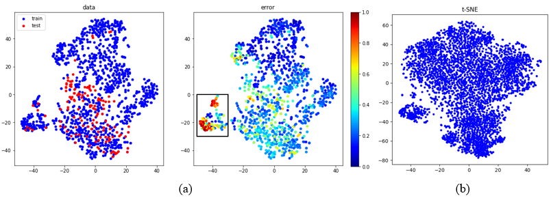
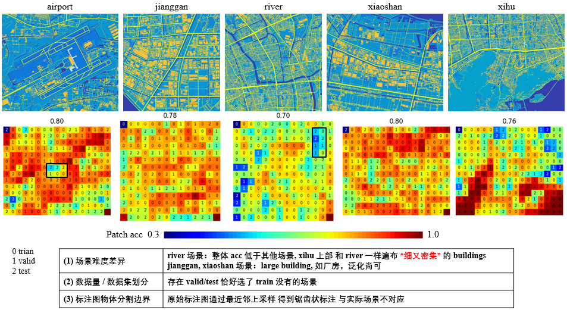
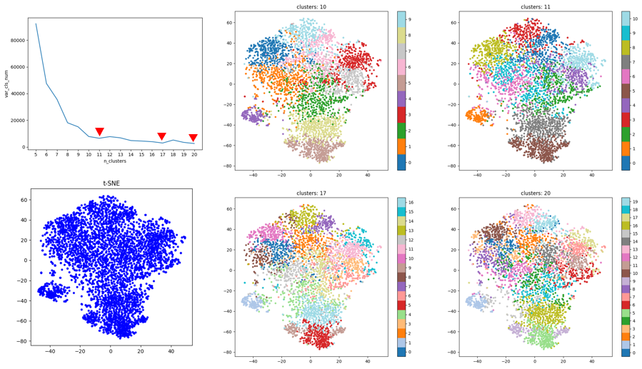
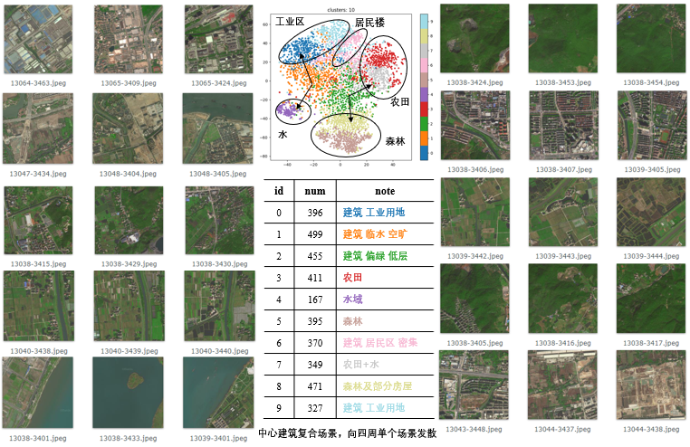

## 数据发现

爬取杭州地区瓦片卫星图，使用 pretrained_model 编码图像，聚类发现场景特点。

### 1. 比较 Stage1 杭州5区数据 和 杭州全部数据

杭州5区数据集 和 杭州整体数据集 图像降维分布

- 图 (a) 为杭州5区数据 train/test 划分，以及 error 分布；**整体更加稀疏，部分 test 样本周边没有 train 样本**
- 图 (b) 为杭州全部数据的降维分布

计算杭州 5 区每个瓦片图分割 acc，**从空间上直观发现困难场景**。

- river 中包含较多困难场景，密集的居民区，房屋尺寸较小。
- 标注噪声也影响 acc，与大面积同类的水域，森林相比，密集居民区 不用类别边界存在较多标注噪声。

### 2. 聚类杭州全部卫星图，分析各个簇代表的场景

聚类簇数：图1 为 **簇数** 与 **簇数量方差** 关系，取折线谷值 10 为簇数，兼顾均衡与场景粒度。

聚为 10 类场景，**每类场景图像** 与 **簇空间位置** 如下图。

- 聚类散点图，中心倾向于复合场景，四周倾向于单一场景，如农田、水域、森林；
- 聚类中心 encoder 向量，可辅助于特定场景图像的爬取。
- **簇 6 反应了杭州 5 区中 river 场景的密集居民区**。

